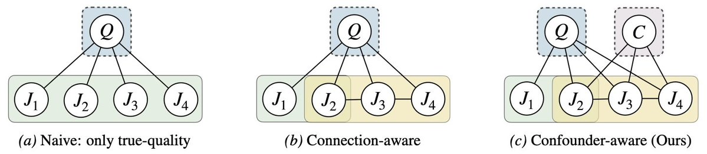
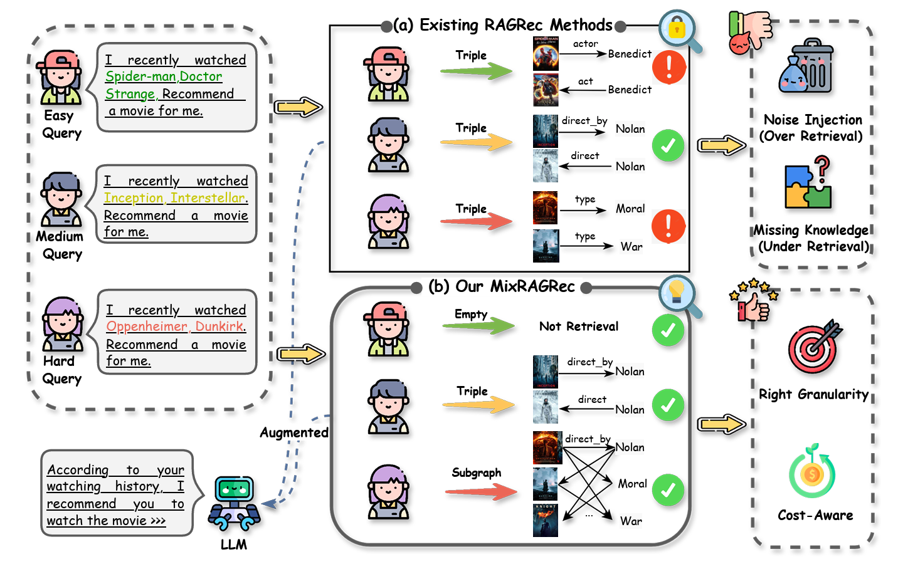

# Comparison Architecture Samples

Use these only for comparison figures that contrast different method architectures or different structural variants.

## Sample 1

## Sample 2

## What To Notice

- Side-by-side architecture contrast.
- Each method shown with consistent visual grammar.
- Clear structural differences rather than only metric differences.
- Compact schematic labels and readable callouts.
- Fair comparison layout with aligned components.
