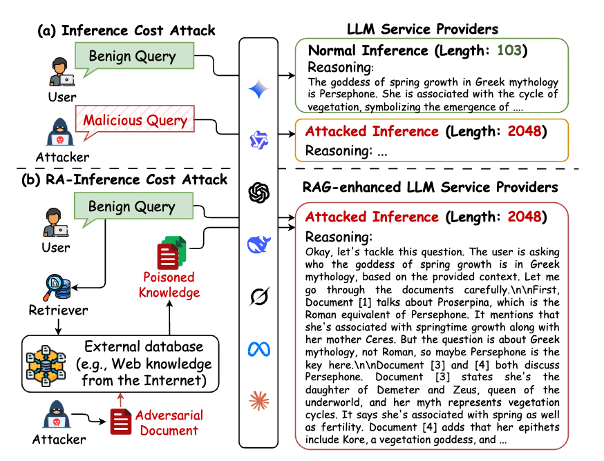

# Motivation / Comparison Samples

Use these for figures that combine problem motivation with method comparison, attack-vs-defense setups, failure-mode contrasts, or structural comparisons where the gap itself is the point.

## Sample 1

## What To Notice

- Left-right contrast between vulnerable and improved setups.
- Problem framing tied directly to the comparison.
- Dense but readable multi-panel structure.
- Clear emphasis on the failure mode and remedy.
- Useful when motivation and comparison are fused into one figure.
