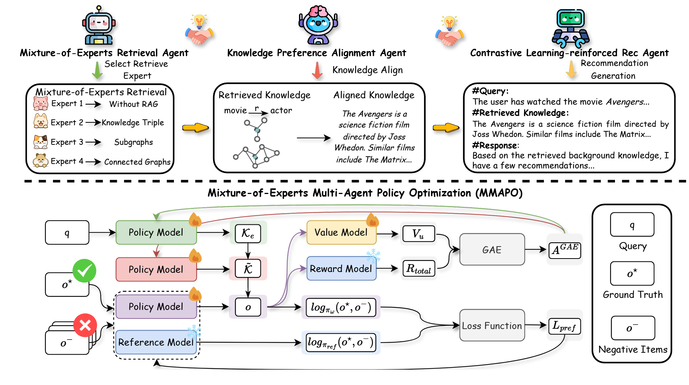
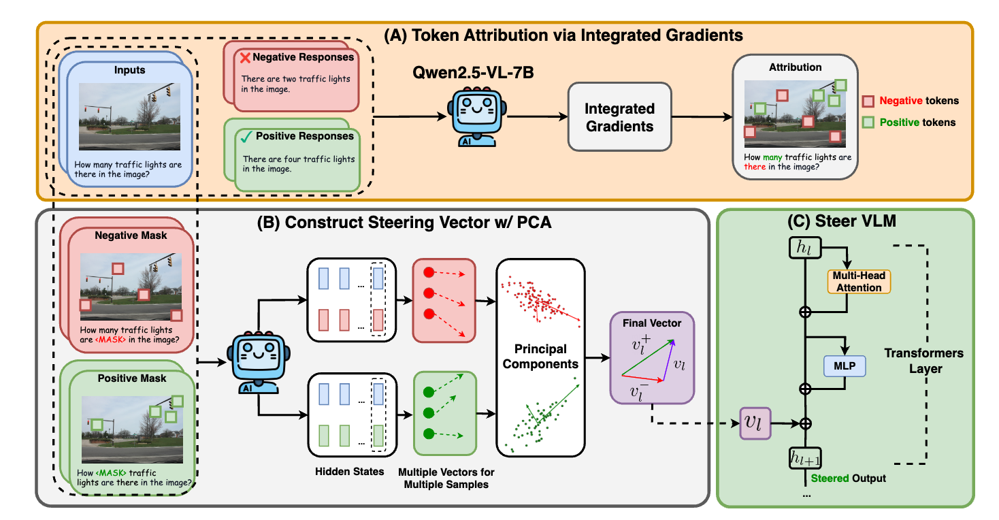
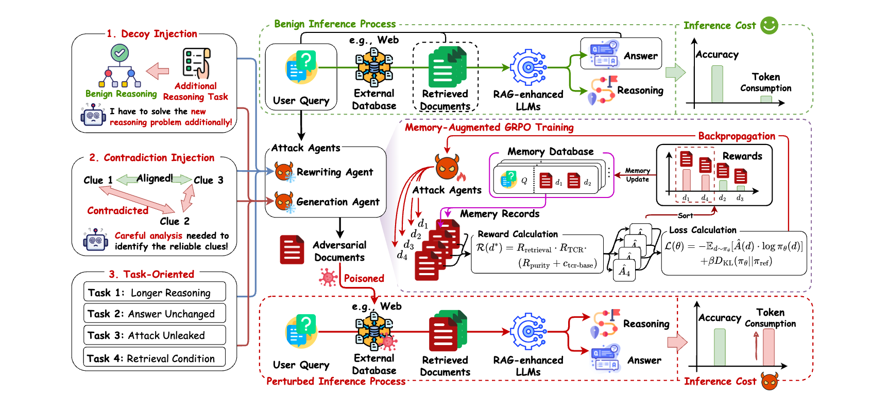

# Pipeline / Framework Samples

Use these only for paper framework figures, method overviews, and training or inference pipeline diagrams.

## Sample 1

## Sample 2

## Sample 3

## What To Notice

- Modular grouped regions with clear arrows.
- Strong central flow or backbone structure.
- Dense but readable scientific notation.
- Distinct visual grammar for input, model, objective, and output.
- Paper-figure style rather than poster or media-card style.
