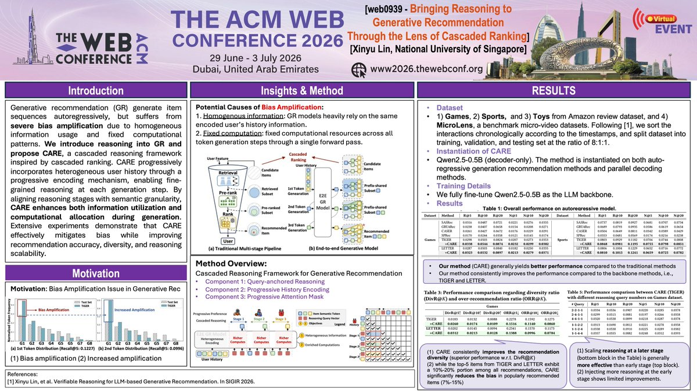

# Poster Sample References

Use these only for `Poster Figure` style requests.

## Sample: WWW Poster

## What To Notice

- Strong poster-style top band and section hierarchy.
- Conference-highlight layout with clear reading zones.
- Dense but scannable evidence panels.
- Large-format composition with strong center of gravity.
- Table-and-panel mix suitable for poster summaries.
