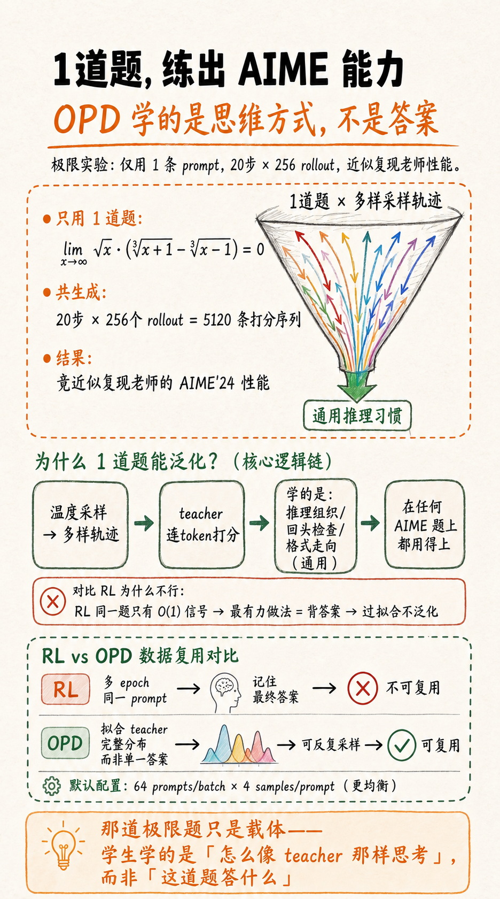
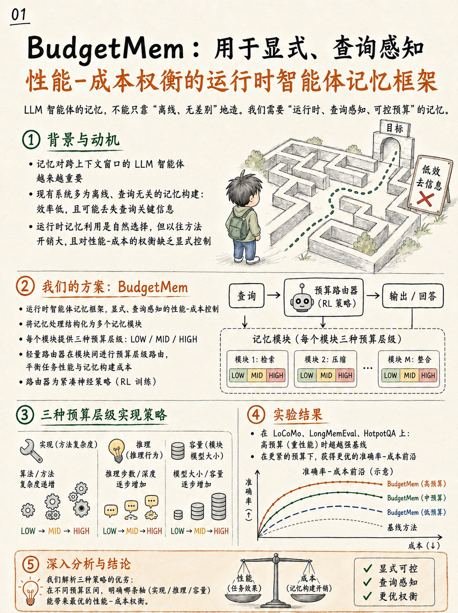

# Research Media Card Examples

Use these as reference samples for the `Research Media Card v1.0` style.

## Sample 1

## Sample 2

## What To Notice

- Strong headline-first hierarchy.
- Independent cards for one idea each.
- Warm editorial paper-like background.
- Simple metaphor-driven illustrations.
- Short labels and minimal text density.
- Science-communication tone rather than pipeline fidelity.
